# L12 MaxLPS: Live Redfish Implementation Proposal

**Status:** draft for implementation  
**Date:** 11 September 2026  
**Scope:** Replace the simulated power limiter in L12 with an out-of-band closed loop against NVIDIA HGX BMCs (GB300 / HGX_Baseboard_0).  
**Does not cover:** NVIDIA Domain Power Services / official MaxLPS Helm stack. This is the DIY Redfish path we already prototyped in the UI.

---

## 1. The proposal (one slide)

The L12 dashboard already runs the loop. On the live floor we keep that math and change only the I/O: **read GPU watts from the BMC, write a non-persistent SetPoint, clear it on Replay.**

Walk **Figure 1** top to bottom:

1. **Total power** is typed today. A smart breaker can fill the same field later.
2. **Default kW/rack** = `(total × threshold%) / racks`, clamped to **[min, max]**.
3. Each tick: **GET** usage → steal idle slack / feed hot racks / **enable extra racks** from leftover → **PATCH** SetPoint.
4. **POST ClearOOB** if the operator hits Replay or the allocator dies.

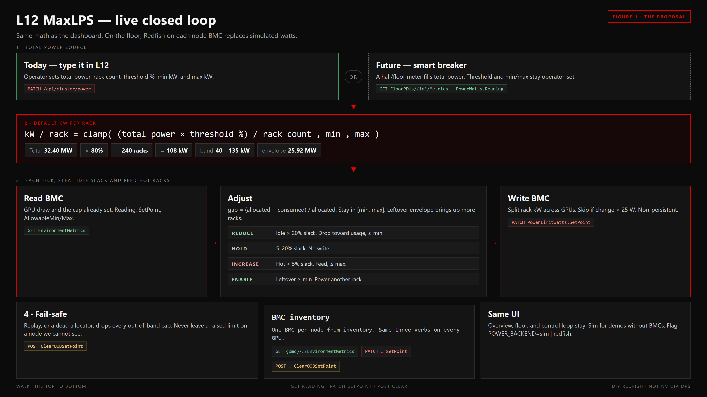

**Figure 1 — present this first.** Same loop as the UI. Each GPU BMC is read and written from inventory. Secrets stay out of git.

| Demo today (`backend/app/power_limit.py`) | Live |
|---|---|
| Fake `demand_kw` from rack `run_status` | `GET …/EnvironmentMetrics` → `PowerWatts.Reading` |
| In-memory `alloc[rack_id]` | Sum of GPU `PowerLimitWatts.SetPoint` on that node/rack |
| No hardware write | `PATCH …/EnvironmentMetrics` with `PowerLimitWatts.SetPoint` |
| Replay / reset | `POST …/ClearOOBSetPoint` |

### What the live UI already draws

Captured from the running L12 app at **135 kW / rack · stay under 80%** (policy 108 kW, hall envelope 25.92 MW, 240 racks on, 35 saturating):

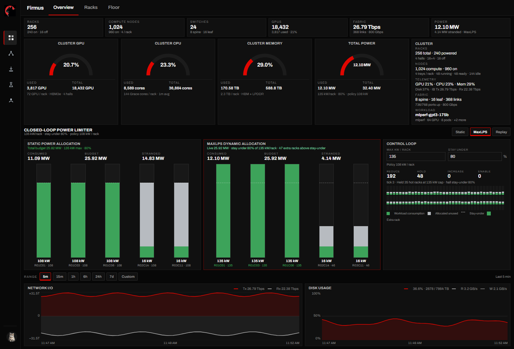

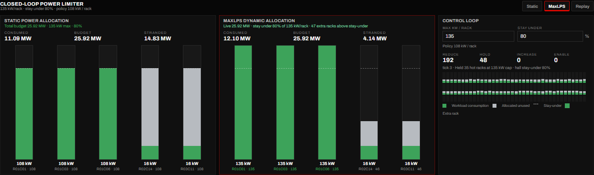

The same numbers, redrawn as a NieR HUD (beige CRT, hairline grid, rust = at-cap). Static allocation is a flat 108 kW. MaxLPS crosses the dashed stay-under line on hot racks and drops idle racks to ~37 kW.

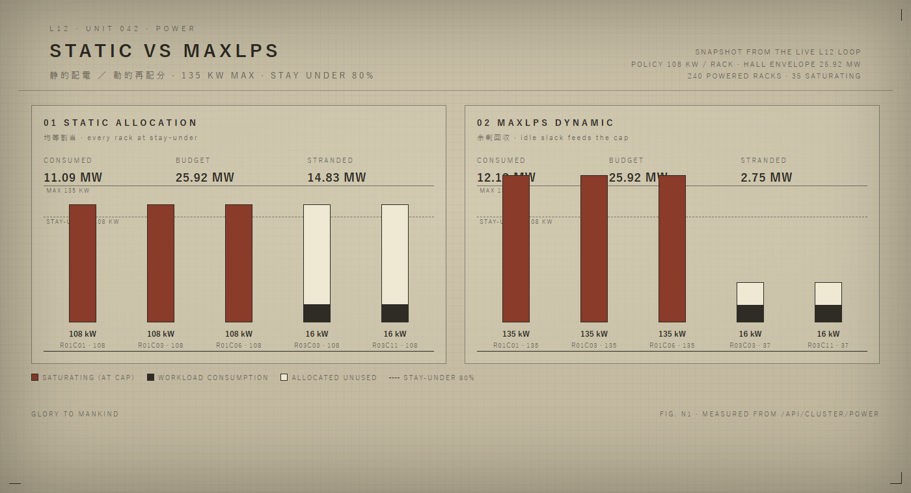

---

## 2. Lab endpoints (verified curl)

These are the live HGX paths. Hosts differ: **223** is a metrics node, **206** is a writable node. Inventory must treat BMC IP as per-node, not a single VIP.

### 2.1 Read live power (sensor)

```bash
curl -k -u "$BMC_USER:$BMC_PASS" \
  https://10.10.78.223/redfish/v1/Systems/HGX_Baseboard_0/Processors/GPU_0/EnvironmentMetrics
```

Expect a payload that includes at least:

- current draw (`PowerWatts.Reading` or `PowerLimitWatts.Reading` — confirm on first GET; NVIDIA B200/GB300 EnvironmentMetrics carries **Reading**, **AllowableMin**, **AllowableMax**)
- the active cap (`PowerLimitWatts.SetPoint` / `LimitInWatts`)
- OEM NVIDIA fields for persistency

Enumerate GPUs. Lab used `GPU_0`. NVIDIA docs also use `GPU_SXM_<id>`. Discovery:

```bash
curl -k -u "$BMC_USER:$BMC_PASS" \
  https://10.10.78.223/redfish/v1/Systems/HGX_Baseboard_0/Processors
```

Then GET `…/Processors/<Id>/EnvironmentMetrics` for each GPU member.

### 2.2 Set a power limit (actuator)

Non-persistent OOB cap (BMC `nvidia-power-manager` applies the throttle):

```bash
curl -k -u "$BMC_USER:$BMC_PASS" -X PATCH \
  -H "Content-Type: application/json" \
  https://10.10.78.206/redfish/v1/Systems/HGX_Baseboard_0/Processors/GPU_0/EnvironmentMetrics \
  -d '{"PowerLimitWatts":{"SetPoint":1500},"Oem":{"Nvidia":{"PowerLimitPersistency":false}}}'
```

`SetPoint` is **watts per GPU**. 1500 W is a GB300-class example. Clamp every write to that GPU’s `AllowableMin` / `AllowableMax` from the GET.

Minimal form (same resource):

```json
{
  "PowerLimitWatts": { "SetPoint": 750 }
}
```

### 2.3 Reset to default (fail-safe / Replay)

```bash
curl -k -u "$BMC_USER:$BMC_PASS" -X POST \
  -H "Content-Type: application/json" \
  https://10.10.78.206/redfish/v1/Systems/HGX_Baseboard_0/Processors/GPU_0/EnvironmentMetrics/Actions/Oem/NvidiaEnvironmentMetrics.ClearOOBSetPoint \
  -d '{}'
```

This is the hardware equivalent of L12 **Replay**: drop OOB setpoints so firmware returns to the default envelope.

**Credentials:** Basic auth as `root`. Do not store BMC passwords in this repo or in the L12 SQLite. Put them in the environment / a secret store (`BMC_USER`, `BMC_PASS`, or per-node vault entries). TLS is currently `-k` (self-signed). Production should pin the BMC CA.

---

## 3. Inventory model

Map Redfish objects onto the L12 cluster model we already ship.

| L12 object | Live object | Notes |
|---|---|---|
| Data hall | Hall / row PDU domain | Same hall pooling as the demo |
| Rack | Physical GB300 rack | UI: **total budget**, **rack count**, **max kW / rack** |
| Compute tray / node | `Systems/HGX_Baseboard_0` at one BMC IP | 4 trays/rack in the demo; confirm live tray count |
| GPU | `Processors/GPU_N` (or `GPU_SXM_N`) | EnvironmentMetrics is per GPU |
| Workload / test | Job on those GPUs | Optional: Slurm/K8s node list → hot set |

New table (or YAML inventory, versioned):

```text
node_id        bmc_ip         rack_id     hall_id    gpu_ids
hgx-223        10.10.78.223   R01C01      DH-01      GPU_0..GPU_7
hgx-206        10.10.78.206   R01C02      DH-01      GPU_0..GPU_7
```

Until that inventory exists, hard-code the two lab BMCs and discover GPU members from `/Processors`.

**Aggregation**

```
gpu_consumed_w  = EnvironmentMetrics.PowerWatts.Reading
gpu_cap_w       = EnvironmentMetrics.PowerLimitWatts.SetPoint
node_consumed_w = sum(gpu_consumed_w)
node_cap_w      = sum(gpu_cap_w)
rack_consumed_kw = sum(nodes in rack) / 1000
rack_allocated_kw = sum(node_cap_w) / 1000
```

That is exactly the `consumed_kw` / `allocated_kw` pair the overview bars and 3D fill already plot.

---

## 4. Architecture (three stages)

Keep the NVIDIA DIY split. Run it as one service next to L12 (or inside the FastAPI app as a worker).

```
                    ┌─────────────────────────────────────────┐
  L12 UI            │  Allocator (the brain)                  │
  total budget   ──►│    share = budget / racks               │
  rack count        │    policy = min(share, max_rack_kw)     │
  max kW / rack     │    per hall: steal slack, feed at-cap   │
                    └────────────┬──────────────▲─────────────┘
                                 │ PATCH SetPoint│ GET Reading
                                 ▼              │
                    ┌────────────┴──────────────┴─────────────┐
                    │  Redfish I/O (sensor + actuator)        │
                    │  rate-limited, per-BMC session, retry   │
                    └────────────┬──────────────▲─────────────┘
                                 │              │
                    BMC 10.10.78.223 / .206  HGX_Baseboard_0
                                 │              │
                                 ▼              │
                    nvidia-power-manager → GPU PMU
```

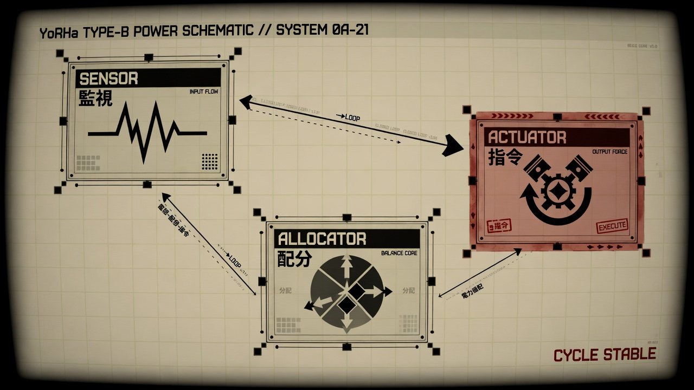

### 4.1 Monitoring loop (sensor)

- One **session per BMC** (HTTP keep-alive). Do not open a new TLS handshake per GPU per tick.
- Parallelism: **across BMCs**, not a stampede of GETs on one BMC.
- Period: **5–10 seconds**. Faster than that risks BMC firmware stalls (see §7).
- Timeout: 2–3 s per GET; on timeout, mark the node `stale` and do **not** raise its cap.
- Parse `Reading`, `AllowableMin`, `AllowableMax`, current `SetPoint`.
- Publish a snapshot compatible with today’s `/api/cluster/power` so the UI does not change.

Suggested collector output (one tick):

```json
{
  "ts": 1770000000,
  "nodes": [
    {
      "bmc_ip": "10.10.78.223",
      "gpus": [
        {
          "id": "GPU_0",
          "reading_w": 912,
          "setpoint_w": 1500,
          "min_w": 200,
          "max_w": 1500
        }
      ]
    }
  ]
}
```

### 4.2 Allocation control (brain)

Port `backend/app/power_limit.py` from simulated racks to live racks. Same constants and actions:

| Knob | Demo | Live |
|---|---|---|
| `total_budget_kw` | Manual MW (future: breaker `PowerWatts.Reading`) | Same watts, split across GPUs |
| `stay_under_pct` / threshold | % of total power | Envelope = total × threshold% |
| `rack_count` | UI count | `default_kw = envelope / racks` |
| `min_rack_kw` | Floor the loop will not go below | Clamp GPU SetPoint ≥ AllowableMin and this floor |
| `max_rack_kw` | Ceiling per rack | Clamp GPU SetPoint ≤ AllowableMax and this cap |
| Reduce | slack **> 20%** of allocation | `gap = (cap − reading) / cap > 0.20` |
| Increase / at cap | slack **< 5%** | `gap < 0.05` or `reading ≥ 0.95 × SetPoint` |
| Hold | 5–20% slack | same |
| Hall pool | steal idle → feed hot **inside the hall** | same; never pull from another hall |
| Facility ceiling | 135 MW | keep as a config ceiling (PDU / hall breaker) |
| Replay | reset in-memory alloc | `ClearOOBSetPoint` on every GPU in scope |

**Per-tick algorithm (same as the demo, with real numbers)**

1. `envelope_w = total_power_w × threshold_pct / 100`. `share_w = envelope_w / rack_count`. `policy_w = clamp(share_w, min_rack_w, max_rack_w)`.
2. Seed (or clamp) `sum(SetPoint)` on each powered rack to `policy_w`, spread evenly across GPUs, each clamped to `[AllowableMin, AllowableMax]`.
3. `consumed = sum(Reading)`, `allocated = sum(SetPoint)`, `gap = (allocated − consumed) / allocated`.
4. **Reduce** idle racks toward `consumed / (1 − 0.12)` (12% headroom), never below `min_rack_w` or `AllowableMin` sum.
5. Hall leftover `pool = hall_policy − sum(allocated)`.
6. **Increase** at-cap racks from `pool`, up to **`max_rack_w`**. If share &gt; max, leftover envelope stays unplaced rather than piling onto one rack.
7. If hall total still exceeds policy, trim idle first, then scale.
8. Diff new SetPoints vs last applied; PATCH only GPUs whose target moved by more than a deadband (e.g. **25 W**) so we do not hammer the BMC.

That burst-vs-average split is the whole visual:

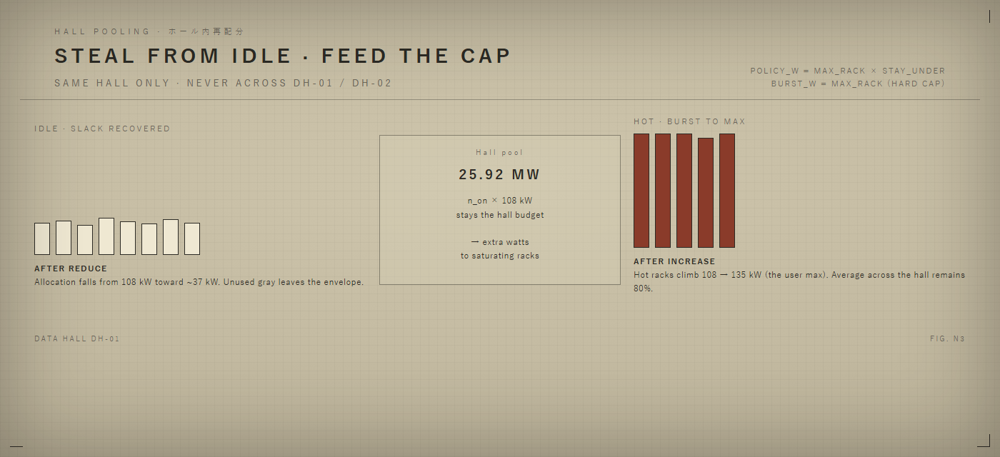

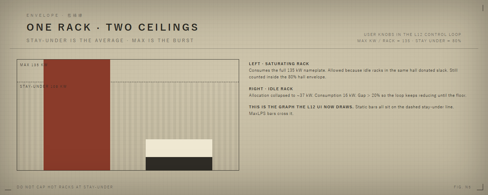

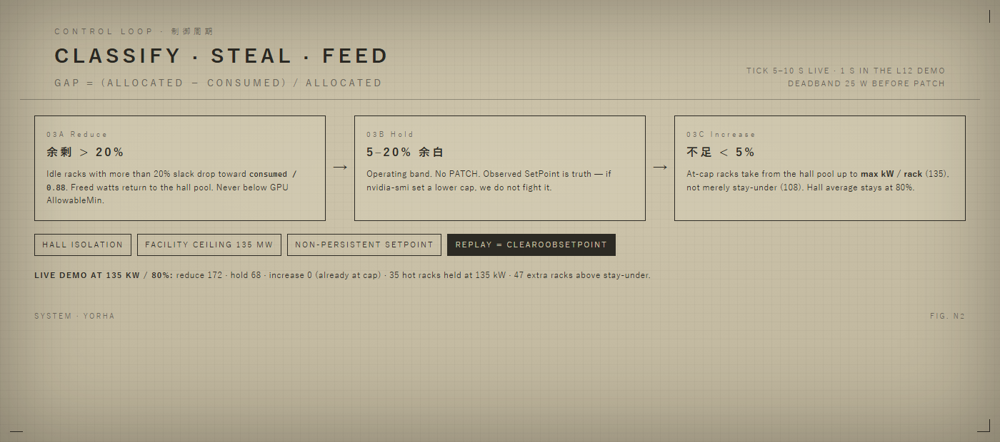

Workload-aware hot set (optional, already in the demo): if a test is running on a known GPU list, treat those GPUs as saturating (`demand ≈ SetPoint`) so they always request increase. Otherwise infer hot from `gap < 5%`.

### 4.3 Actuator (command)

For each GPU whose target changed:

```http
PATCH /redfish/v1/Systems/HGX_Baseboard_0/Processors/{gpu_id}/EnvironmentMetrics
{
  "PowerLimitWatts": { "SetPoint": 750 },
  "Oem": { "Nvidia": { "PowerLimitPersistency": false } }
}
```

Rules:

- **Non-persistent** (`PowerLimitPersistency: false`) so a BMC reboot does not leave a stale aggressive cap. Persistence is a later, explicit policy.
- Batch PATCHes per BMC with a small concurrency (2–4). Never PATCH every GPU on a tray in one unthrottled blast.
- After PATCH, the next GET confirms `SetPoint`. If it disagrees, retry once, then alarm.
- **Most conservative policy:** if `nvidia-smi` or another in-band agent also sets a cap, the GPU keeps the **lower** of the two. The allocator must treat the observed SetPoint as truth, not the last PATCH we sent.

Replay / emergency:

```http
POST …/EnvironmentMetrics/Actions/Oem/NvidiaEnvironmentMetrics.ClearOOBSetPoint
{}
```

Wire L12 **Replay** to this action for the selected hall or whole cluster.

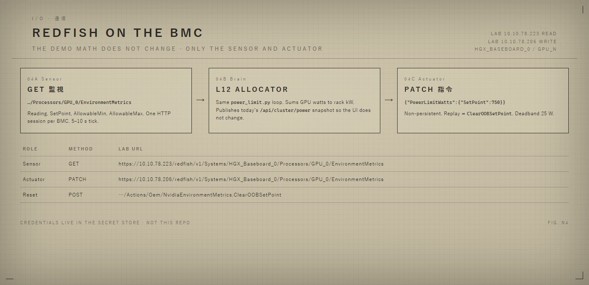

---

## 5. Mapping the L12 UI to live data

No new screens. `/api/cluster/power` already returns what the overview and 3D floor consume.

| UI | Live source |
|---|---|
| Control loop **Total power** | Manual MW today · future smart-breaker `PowerWatts.Reading` |
| **Threshold %** | Envelope = total × threshold |
| **Racks** | `default_kw = envelope / racks` |
| **Min / max kW / rack** | Loop band; leftover above max is unplaced |
| Consumed / allocated bars | `sum(Reading)` / `sum(SetPoint)` |
| 3D rack fill | `Reading / SetPoint` (at-cap = red) |
| Reduce / Hold / Increase counts | Same classifiers as `power_limit.py` |
| Replay | `ClearOOBSetPoint` |
| Testing “run a job” | Optional: mark those GPUs saturating |

Feature flag: `POWER_BACKEND=sim|redfish`. Sim stays for demos without BMCs. Redfish mode requires the inventory file and BMC secrets.

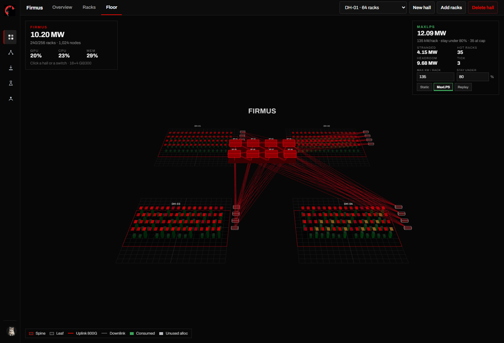

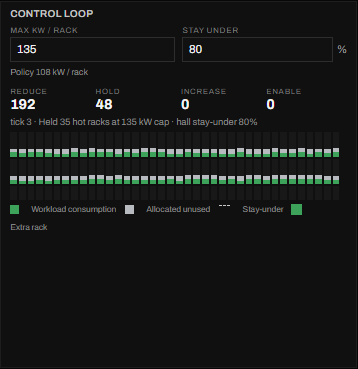

---

## 6. Safety (must ship with the first live loop)

1. **Watchdog.** If the allocator process dies or cannot reach a BMC for N ticks (e.g. 3 × 10 s), that node’s GPUs go to a **safe SetPoint** (policy floor or ClearOOBSetPoint). Do not leave a raised cap on a disconnected node.
2. **Deadband + period.** 5–10 s loop, ≥25 W change before PATCH. Protects BMC firmware.
3. **AllowableMin / AllowableMax.** Never write outside the GET bounds.
4. **Hall and facility clamps.** Same as the demo: hall pool first, then cluster ceiling.
5. **Dry run.** Log intended PATCHes for a week with GETs only (`POWER_ACTUATE=false`).
6. **No conflict with in-band tools.** Document that nvidia-smi caps win if lower; disable conflicting daemons on nodes in the pool.
7. **Auth and TLS.** Secrets out of git; replace `curl -k` with a pinned CA before production.
8. **Audit.** Every PATCH: timestamp, gpu id, old SetPoint, new SetPoint, reason (`reduce` / `increase` / `hold` / `watchdog`).

---

## 7. Implementation plan

### Phase 0 — Prove the pipes (1–2 days)

On the two lab BMCs:

1. GET Processors list on `10.10.78.223` and `10.10.78.206`.
2. GET EnvironmentMetrics for `GPU_0` (and every sibling). Record JSON schema (`Reading`, min, max, SetPoint).
3. PATCH a **small, safe** drop (e.g. 50 W below current SetPoint, still above AllowableMin), confirm Reading/SetPoint, then ClearOOBSetPoint.
4. Write the canonical JSON examples into `docs/redfish-samples/` (no passwords).

### Phase 1 — Collector (3–5 days)

- Inventory YAML + secret injection.
- Async GET fan-out, one client per BMC, 10 s tick.
- Persist last snapshot; expose it on `GET /api/cluster/power` when `POWER_BACKEND=redfish`.
- L12 UI shows **real** consumed vs allocated with actuation disabled.

### Phase 2 — Allocator, dry run (3–5 days)

- Lift `power_limit.py` over live snapshots.
- Emit a PATCH plan each tick; log only.
- Compare plan vs hall stay-under. Tune deadband and gaps (20% / 5%) on real traces.

### Phase 3 — Actuate one tray (1–2 days)

- `POWER_ACTUATE=true` for a single BMC (`10.10.78.206`).
- Non-persistent SetPoints only.
- Manual Replay = ClearOOBSetPoint.
- Watch BMC CPU/HTTP errors.

### Phase 4 — Hall, then cluster

- Enable a full rack, then a hall.
- Wire UI knobs to live config (already PATCH `/api/cluster/power`).
- Add watchdog and facility clamp.

### Phase 5 — Hardening

- CA-pinned TLS, per-node secrets, metrics (tick duration, BMC errors, cap drift).
- Optional: Slurm/K8s → hot GPU set so a running test saturates the same way the demo does.

---

## 8. DIY Redfish vs official NVIDIA MaxLPS

| | This proposal (Redfish + L12 loop) | NVIDIA MaxLPS / DPS |
|---|---|---|
| Interface | OOB Redfish REST on each BMC | Native K8s Helm / NVIDIA stack |
| Latency | Seconds (BMC poll) | Sub-second, inter-node sync |
| Tuning | Watt caps only (`SetPoint`) | Workload Power Profiles (clock curves) |
| Fail-safe | We implement watchdog + ClearOOBSetPoint | Built-in cluster fail-safes |
| Fit | Matches L12 UI and current lab access | Requires DPS entitlement and software |

Use this loop where we already have BMC reachability and need hall-level rebalancing now. Revisit DPS if we need sub-second reaction or WPPS.

---

## 9. Concrete service sketch

New module `backend/app/redfish_power.py` (names illustrative):

- `discover_gpus(bmc) -> list[str]`
- `get_metrics(bmc, gpu_id) -> GpuMetrics`
- `set_limit(bmc, gpu_id, watts, persist=False)`
- `clear_oob(bmc, gpu_id)`
- `tick()` → collect → `power_limit.snapshot(samples)` → diff → actuate

Config (env):

```
POWER_BACKEND=redfish
POWER_ACTUATE=false
POWER_TICK_SEC=10
POWER_DEADBAND_W=25
BMC_INVENTORY=/etc/l12/bmc-inventory.yaml
REDFISH_SYSTEM=HGX_Baseboard_0
```

Inventory row for the lab:

```yaml
nodes:
  - name: hgx-223
    bmc: https://10.10.78.223
    rack: R01C01
    hall: DH-01
    verify_tls: false   # until CA pinned
  - name: hgx-206
    bmc: https://10.10.78.206
    rack: R01C02
    hall: DH-01
    verify_tls: false
```

GPU path template (confirm in Phase 0):

```
/redfish/v1/Systems/HGX_Baseboard_0/Processors/{gpu_id}/EnvironmentMetrics
```

---

## 10. Future: smart breaker as total-power source

Today `P_total` is typed in the control loop. The limiter does not care where the number comes from. A hall or floor **smart breaker / PDU** can replace the manual field:

```
GET  {breaker}/redfish/v1/PowerEquipment/FloorPDUs/{id}/Metrics
     PowerWatts.Reading  →  total_budget_kw   (poll 5–10 s)

# fallbacks if the PDU is not Redfish
Modbus / BACnet meter register → same field
```

Wire it as `POWER_SOURCE=manual|breaker`. Manual stays the default. Breaker mode:

- Overwrites `total_budget_kw` every tick from the meter.
- Threshold %, rack count, min/max kW stay operator-set.
- If the meter goes stale, freeze caps (do not raise) and alarm — same watchdog as a dead BMC.
- Optional: compare breaker reading to `sum(GPU Reading)` as a sanity bound.

Do not put breaker credentials in git. Same secret pattern as BMC.

---

## 11. Open items to close in Phase 0

1. Exact JSON field names on these BMCs (`PowerWatts.Reading` vs nested OEM).
2. GPU id scheme: `GPU_0` vs `GPU_SXM_0` vs both.
3. GPUs per HGX_Baseboard_0 (8 vs 4 vs 72-across-rack).
4. Whether 223 is read-only by policy or just a different password/role than 206.
5. PDU / breaker numbers for a real facility ceiling (replace the 135 MW demo constant).
6. Who owns in-band `nvidia-smi -pl` so we do not fight it.

---

## 12. Recommendation

Implement the live loop as a **flagged backend behind the existing L12 power UI**, using the three Redfish calls we already run by hand:

| Role | Method | Lab URL |
|---|---|---|
| Sensor | GET | `https://10.10.78.223/redfish/v1/Systems/HGX_Baseboard_0/Processors/GPU_0/EnvironmentMetrics` |
| Actuator | PATCH | `https://10.10.78.206/redfish/v1/Systems/HGX_Baseboard_0/Processors/GPU_0/EnvironmentMetrics` |
| Reset | POST | `https://10.10.78.206/redfish/v1/Systems/HGX_Baseboard_0/Processors/GPU_0/EnvironmentMetrics/Actions/Oem/NvidiaEnvironmentMetrics.ClearOOBSetPoint` |

Keep the demo algorithm (max kW/rack, stay-under %, 20% reduce / 5% increase, hall pooling). Poll every 5–10 s, non-persistent SetPoints, ClearOOB on Replay and on watchdog. Prove GET/PATCH/clear on one GPU, then one tray, then a hall.
